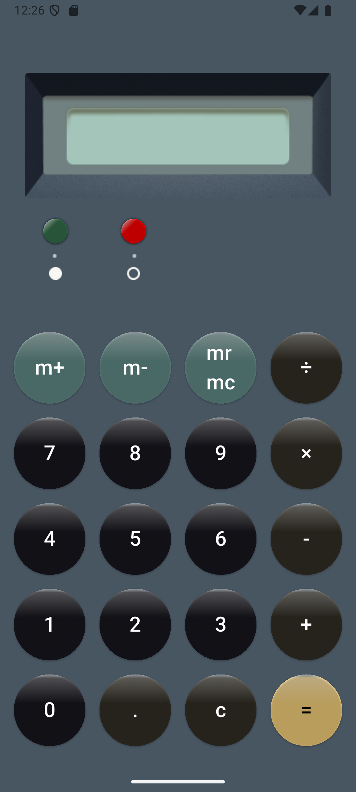
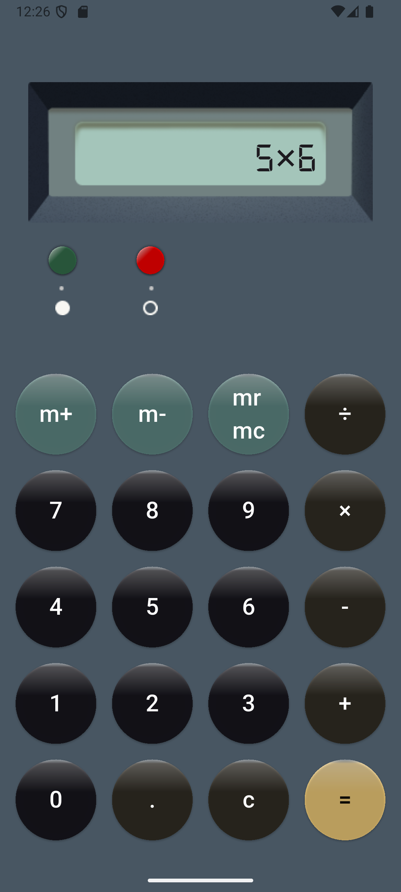

# Flutter Calculator App

A simple and elegant **Calculator App** built with Flutter featuring a **skeuomorphic design** for a realistic look and feel.

## Features
- Basic arithmetic: `+`, `-`, `×`, `÷`
- Memory functions: `M+`, `M-`, `MR/MC`
- Clear (`C`) button
- Expression evaluation using `math_expressions`
- Smooth skeuomorphic UI design

## 🛠 Tech Stack
- **Flutter** – cross-platform UI framework
- **Provider** – state management
- **Math Expressions** – expression parsing and evaluation

## 📸 Screenshots

  
  

## How to Run
1. `git clone https://github.com/your-username/flutter-calculator.git`  
2. `cd flutter-calculator`  
3. `flutter pub get`  
4. `flutter run`

Made with ❤️ by Ghada
